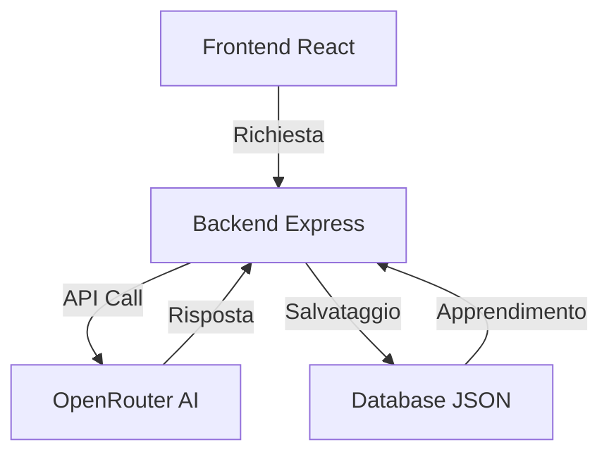

# 📋 Project Overview - Miglioratore Descrizioni Tecniche

## 🎯 Obiettivo Principale
Sviluppare un sistema AI-powered per trasformare descrizioni tecniche frettolose in rapportini professionali completi per il settore IT.  
Esempi di trasformazione:
- "instllazione e test computer" → "Installazione e configurazione sistema operativo. Personalizzazione setup software, test e collaudo periferiche"
- "ho proceduto all'accensione del pc e va tutto bene" → "Test di accensione dispositivo del cliente, nessun malfunzionamento rilevato. Test e collaudi ok"

## 🧠 Core Technology
- **AI Engine**: Deepseek-r1-0528:free via OpenRouter API
- **Frontend**: React.js (Vite) + Tailwind CSS
- **Backend**: Node.js/Express.js
- **Database**: JSON-based con sistema di apprendimento automatico
- **Deployment**: Render/Vercel

## 🏗️ Architettura Sistema


## 📂 Struttura Directory Principale
```
.
├── Deep-AI/                 # Backend e logica AI
├── frontend-riformula/      # Applicazione React
├── docs/                    # Documentazione progetto
├── database/                # File JSON per dati persistenti
└── scripts/                 # Script di utilità
```

## 🔑 Componenti Critici
1. `riformulaDescrizione.js` - Core AI processing
2. `App.jsx` - UI principale
3. `learning-system.js` - Sistema apprendimento
4. `input-validator.js` - Preprocessing input
5. `cache-manager.js` - Gestione cache ottimizzata

## 🚀 Roadmap Strategica
- Fase 1: Ottimizzazione qualità output (Task 1)
- Fase 2: Implementazione learning system (Task 2)
- Fase 3: Miglioramento UX/performance (Task 3-5)
- Fase 4: Funzionalità avanzate (Task 6)

## 📊 Metriche Successo
| Metriche | Target | Stato Attuale |
|----------|--------|---------------|
| Accuratezza | 95% | 85% |
| Tempo Risposta | <2s | ~3s |
| Soddisfazione Utente | 90% | 75% |
