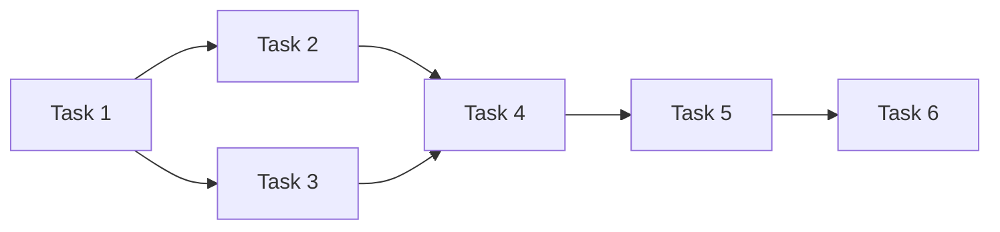

# 🗺️ Task Roadmap - Miglioratore Descrizioni Tecniche

## 📌 Task Priority Order
1. **Task 1: Ottimizzazione Prompt AI e Qualità Output** (HIGH PRIORITY)
2. **Task 2: Sistema di Apprendimento Migliorato** (HIGH PRIORITY)
3. **Task 3: Validazione e Preprocessing Input** (MEDIUM PRIORITY)
4. **Task 4: Miglioramenti UX/UI** (MEDIUM PRIORITY)
5. **Task 5: Performance e Robustezza** (LOW PRIORITY)
6. **Task 6: Features Avanzate** (LOW PRIORITY)

---

## 🔧 Task 1: Ottimizzazione Prompt AI e Qualità Output
**Stato:** TODO  
**Complessità:** ★★★☆☆ (3/5)  
**Tempo Stimato:** 2 ore  
**File Coinvolti:**
- `Deep-AI/riformulaDescrizione.js`

**Azioni Specifiche:**
1. Sostituire il prompt system attuale con versione ottimizzata per contesto IT
2. Aggiungere 5 esempi di trasformazione nel prompt
3. Implementare riconoscimento automatico del tipo di attività
4. Migliorare post-processing per output coerenti
5. Aggiungere validazione dell'output prima di restituirlo

**Nuovo Prompt Proposto:**
```javascript
const SYSTEM_PROMPT = `Sei un tecnico IT esperto. Riformula direttamente l'input in rapportino tecnico professionale italiano seguendo queste regole:
1. Usa SEMPRE italiano tecnico formale
2. Forma impersonale (terza persona)
3. Massimo 2 frasi complete
4. Termina con punto
5. Mantieni nomi propri e termini tecnici
6. Non aggiungere dettagli non presenti nell'input
7. Riconosci il tipo di attività: [installazione|riparazione|test|configurazione|manutenzione]

Esempi:
- "instllazione e test computer" → "Installazione e configurazione sistema operativo. Personalizzazione setup software, test e collaudo periferiche."
- "ho acceso pc ok" → "Test di accensione dispositivo, nessun malfunzionamento rilevato. Collaudo generale ok."`;
```

---

## 🧠 Task 2: Sistema di Apprendimento Migliorato
**Stato:** TODO  
**Complessità:** ★★★★☆ (4/5)  
**Tempo Stimato:** 3 ore  
**File Coinvolti:**
- `Deep-AI/riformulaDescrizione.js`
- `Deep-AI/learning-system.js` (nuovo)
- `Deep-AI/patterns-db.json` (nuovo)

**Azioni Specifiche:**
1. Implementare algoritmo di similarity matching (cosine similarity)
2. Creare struttura database per esempi corretti
3. Implementare auto-suggestion basata su correzioni
4. Aggiungere sistema di scoring qualità correzioni
5. Creare meccanismo di backup automatico

---

## ⚙️ Task 3: Validazione e Preprocessing Input
**Stato:** TODO  
**Complessità:** ★★★☆☆ (3/5)  
**Tempo Stimato:** 2.5 ore  
**File Coinvolti:**
- `Deep-AI/riformulaDescrizione.js`
- `frontend-riformula/src/App.jsx`
- `Deep-AI/input-validator.js` (nuovo)

**Funzionalità Chiave:**
- [ ] Correzione automatica typos comuni
- [ ] Riconoscimento tipo attività
- [ ] Suggerimenti in tempo reale
- [ ] Normalizzazione abbreviazioni
- [ ] Validazione semantica

---

## 🎨 Task 4: Miglioramenti UX/UI
**Stato:** TODO  
**Complessità:** ★★☆☆☆ (2/5)  
**Tempo Stimato:** 2 ore  
**File Coinvolti:**
- `frontend-riformula/src/App.jsx`
- `frontend-riformula/src/index.css`
- `frontend-riformula/src/components/TemplateSelector.jsx` (nuovo)
- `frontend-riformula/src/components/HistoryPanel.jsx` (nuovo)

**Componenti UI:**
1. Template Selector (installazione, riparazione, test...)
2. History Panel (ultime 10 descrizioni)
3. Live Preview
4. Feedback categorizzato
5. Confidence indicators

---

## ⚡ Task 5: Performance e Robustezza
**Stato:** TODO  
**Complessità:** ★★★★☆ (4/5)  
**Tempo Stimato:** 2.5 ore  
**File Coinvolti:**
- `Deep-AI/riformulaDescrizione.js`
- `Deep-AI/cache-manager.js` (nuovo)
- `Deep-AI/backup-system.js` (nuovo)
- `Deep-AI/monitoring.js` (nuovo)

**Ottimizzazioni:**
- Cache L1 (memoria) + L2 (disco)
- Retry policy con exponential backoff
- Backup automatico orario
- Logging strutturato
- Monitoring performance

---

## 🚀 Task 6: Features Avanzate
**Stato:** TODO  
**Complessità:** ★★★★★ (5/5)  
**Tempo Stimato:** 4 ore  
**File Coinvolti:**
- `frontend-riformula/src/App.jsx`
- `Deep-AI/riformulaDescrizione.js`
- `frontend-riformula/src/components/BatchProcessor.jsx` (nuovo)
- `frontend-riformula/src/components/StatsPanel.jsx` (nuovo)
- `Deep-AI/export-import.js` (nuovo)

**Features:**
- Batch processing (fino a 50 descrizioni)
- Export/import (CSV/JSON/Excel)
- Stats dashboard
- API endpoints
- Advanced settings panel

---

## 🔄 Dipendenze tra Task


**Ultimo Aggiornamento:** 04/06/2025 00:45
